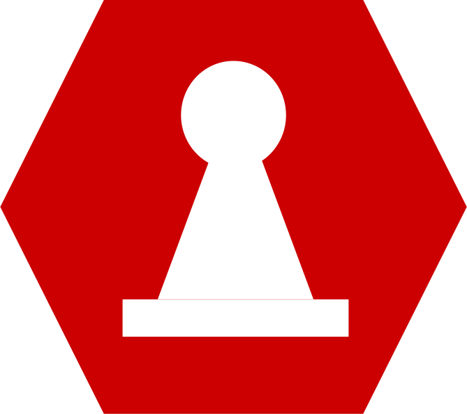

# NGINS
NGINS is a really bad chess engine I'm making for fun, because I was bored and
wanted to try something new!

Yes, the name is a reference to NGINX, the web server, but with S from Chess.

Fully client-side for now, I'll probably make a Rust backend later (that is
if I learn Rust).

TBD